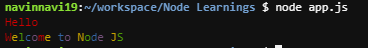
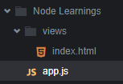
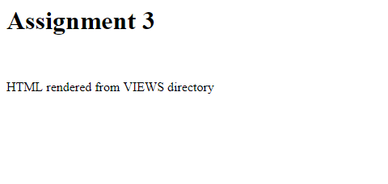

# Code Snippets  :

1. **An Object type in Java Script and added functions & variables to it?**

**Answer**

**Code**
```js
// Created an Object
var project = {
name : "Project Name: Creating an Object Type",
owner : "Project Owner: Navin",
description : () => {
        console.log("Project Description: 'project' is a simple object created to add variables and functions for the assignment");
    },
    created : () => {
        console.log("Project Creation: 'project' was created on 18th March 2019");
    }
};

console.log(project.name);
console.log(project.owner);
project.description();
project.created();
```
**Console Log**
```console
navinnavi19:~/workspace/Node Learnings $ node app.js 
Project Name: Creating an Object Type
Project Owner: Navin
Project Description: 'project' is a simple object created to add variables and functions for the assignment
Project Creation: 'project' was created on 18th March 2019
```

2. **Create array then add variables and function to it through push()**

**Answer**

**Code**
```js
// Created an Array
var createArray = [];

// Created an Object
var project1 = {
    name : "Project Name: Creating an Object Type",
    owner : "Project Owner: Navin",
    description : () => {
        console.log(project1.name);
        console.log(project1.owner);
        console.log("Project Description: 'project1' is a simple object created to add variables and functions for the assignment");
        project1.created();
    },
    created : () => {
        console.log("Project Creation: 'project' was created on 18th March 2019");
    }
};

// Pushing a strings and an Object
createArray.push("Project1", project1);
createArray.push("Project2");

// Creating variables and functions
var name = "Project2";
var description = () => console.log("Project Description: 'project2' is a simple array created to add variables and functions for the assignment");

// Pushing Variables and functions
createArray.push(name, description);

console.log(createArray);

project1.description();
```
**Console Log**
```console
$ node app.js 
[ 'Project1',
{ name: 'Project Name: Creating an Object Type',
    owner: 'Project Owner: Navin',
    description: [Function: description],
    created: [Function: created] },
'Project2',
'Project2',
[Function: description] ]
Project Name: Creating an Object Type
Project Owner: Navin
Project Description: 'project1' is a simple object created to add variables and functions for the assignment
Project Creation: 'project' was created on 18th March 2019
```

3. **Access the present Working directory**

**Answer**

**Code**
```js
console.log(process.cwd());
```

**Console Log**
```console
 $ node app.js 
/home/ubuntu/workspace/Node Learnings
```

4. **Reads the name of the directory  from the command line arguments and displays the list of directory contents (using fs module)**

**Answer**

**Code**
```js
const fs = require('fs');
const commandLineArg = process.argv[2];

fs.readdir(commandLineArg, (err, files) => {
    if (err) throw err;
    console.log(`Contents of the ${commandLineArg} folder`);
    files.forEach((file) => {
        console.log(file);
    });
});
```

**Console Log**
```console
$ node app.js test
Contents of the test folder
bar.txt
foo.html
foobar.pdf
```

5. **Reads the file name from console and displays the contents of the file**
- Synchronous mode
- Asynchronous mode

**Answer**

**Code**
```js
const fs = require('fs');
const commandLineArg = process.argv[2];

// Asynchronous Mode
fs.readFile(commandLineArg, (err, data) => {
    if(err) throw err;
    console.log("\n Reading the file contents using Asynchronous Method \n");
    console.log(data.toString());
});

// Synchronous Mode
const data = fs.readFileSync(commandLineArg);
console.log("Reading the file contents using Synchronous Method \n");
console.log(data.toString());
```

**Console Log**
```console
$ node app.js bar.txt
Reading the file contents using Synchronous Method 

Project Name: Creating an Object Type
Project Owner: Navin

Reading the file contents using Asynchronous Method 

Project Name: Creating an Object Type
Project Owner: Navin
```

6. **Displays a message through loop, with delay in between the iterations Using setTimeOut()**

**Answer**

**Code**
```js
let maxtime = 1000;

for(var i = 0; i < 10; i++) {
    let delay = Math.floor((Math.random()*maxtime)+1);
    setTimeout(() => {
        console.log("I am printed at %sms", delay);
    }, delay);
}
```

**Console Log**
```console
$ node app.js
I am printed at 88ms
I am printed at 234ms
I am printed at 462ms
I am printed at 510ms
I am printed at 551ms
I am printed at 632ms
I am printed at 651ms
I am printed at 712ms
I am printed at 742ms
I am printed at 837ms
```

7. **Using ‘http’ module Downloads the content from google home page to a file**

**Answer**

**Code**
```js
const http = require('http');
const fs = require('fs');

const options = {
host: "www.google.com",
port: "80",
path: "/"
};

const callback = (res) => {
let body = '';
res.on('data', (data) => {
    body += data;
});

res.on('end', () => {
    fs.writeFile('bar.html', body, 'utf-8', (err) => {
    if(err) throw err;
    });
});
};

var req = http.request(options, callback);
req.end();
```

**Output**

**Formatted Downloaded Google Homepage**

<p align="center">
<kbd></kbd>
</p>

8. **Create a HTTP server that responds to requests. (using http module)**

**Answer**

**Code**
```js
const http = require('http');

const server = http.createServer((req, res) => {
res.write("<h1>Hello World</h1>");
res.write("<h2>HTML response from the server</h2>");
res.write("<p>Created a simple HTTP server that responds to requests with a simple HTML response</p>");
res.end();
});

server.listen(process.env.PORT, process.env.IP)
```

**Output**

<p align="center">
<kbd></kbd>
</p>

9. **Chat Application using server and client sockets**

**Answer**

**Code**
```js
// getting the TCP library
const net = require('net');

// creating sockets array to store the clients sockets that are connecting to the server
const sockets = [];

// creating the server to process the client requests from sockets
var server = net.createServer((socket) => {
    // identify the connecting socket
    socket.name = "Socket" + ' : ' + socket.remotePort ;
    
    // Add this socket to the client array
    sockets.push(socket);
    
    // send a nice welcome message and announce
    socket.write("Welcome " + socket.name + '\n');
    broadcast(socket.name + " joined the server \n", socket.name);
    console.log(socket.name + " joined the server \n");
    
    // handle incoming message from the clients
    socket.on('data', (data) => {
        let message = socket.name + " > " + data;
        broadcast(message, socket.name);
        // log the output to server console
        console.log(message);
    });
    
    // socket connection end event
    socket.on("end", () => {
        let message = socket.name + " left the server \n";
        console.log(message);
        // remove the socket from the socket array
        removeSocket(socket);
        
        // broadcast the end message
        broadcast(message, socket.name);
        
    });
    
    // Handle socket Errors
    socket.on("error", (err) => {
        if (err) console.log("Socket has some problem connecting to the server", err.message);
    });
    
    // Broadcasting the messages
    function broadcast(message, sender) {
        
        // if no socket connected
        if(sockets.length === 0) {
            console.log("Everyone has left the server");
            return;
        }
        
        // Broadcast the message to all the sockets
        sockets.forEach((socket) => {
            // broadcast should not be sent to the same server
            if(socket.name === sender) return;
            socket.write(message);
        });
    }
});

// remove the socket from the array
function removeSocket(socket) {
    sockets.splice(sockets.indexof(socket), 1);
}

// Handle server errors
server.on("error", (err) => {
    if (err) console.log("Server could not start", err.message);
});

server.listen(1337, process.env.IP, () => {
    console.log("Server started listening for the socket connections");
});
```

**Console Log**

**Client 1**

```console
$ telnet localhost 1337
Trying ::1...
Trying 127.0.0.1...
Connected to localhost.
Escape character is '^]'.
Welcome Socket : 54740
Socket : 54878 joined the server 
Socket : 54940 joined the server 
I joined FIRST
Socket : 54878 > I Joined SECOND
Socket : 54940 > I Joined THIRD
```

**Client 2**

```console
$ telnet localhost 1337
Trying ::1...
Trying 127.0.0.1...
Connected to localhost.
Escape character is '^]'.
Welcome Socket : 54878
Socket : 54940 joined the server 
Socket : 54740 > I joined FIRST
I Joined SECOND
Socket : 54940 > I Joined THIRD
```

**Client 3**

```console
$ nc localhost 1337
Welcome Socket : 54940
Socket : 54740 > I joined FIRST
Socket : 54878 > I Joined SECOND
I Joined THIRD
```

**Server logged everything**

```console
$ node server.js 
Server started listening for the socket connections
Socket : 54740 joined the server 

Socket : 54878 joined the server 

Socket : 54940 joined the server 

Socket : 54740 > I joined FIRST

Socket : 54878 > I Joined SECOND

Socket : 54940 > I Joined THIRD

Socket : 54740 left the server 

Socket : 54878 left the server 

Socket : 54940 left the server 

Everyone has left the server
```

10. **Using ‘mongodb’ module read the data from a table in ‘mongodb’ database and display the details on console.**

**Answer**

**Data to be read from the database**
```console
> db.documents.find()
{ "_id" : ObjectId("5c920fb46acbbdb5b39c41d8"), "a" : 1 }
{ "_id" : ObjectId("5c920fba6acbbdb5b39c41d9"), "b" : 2 }
{ "_id" : ObjectId("5c920fc16acbbdb5b39c41da"), "c" : 3 }
{ "_id" : ObjectId("5c920fc86acbbdb5b39c41db"), "d" : 4 }
```
**Node Script to read the data from the database**
```js
const MongoClient = require('mongodb').MongoClient;

const url = "mongodb://localhost:27017";
const dbname = "testmongo"

const client = new MongoClient(url, {useNewUrlParser: true});

client.connect((err) => {
if(err) throw err;
console.log("Connected to the database");
const db = client.db(dbname);
readFromDatabase(db, () => {
    client.close();
});
});

function readFromDatabase(db, callback){
const collections = db.collection("documents");
collections.find({}).toArray((err, data) => {
    if(err) throw err;
    console.log(data);
});
}
```

**Console Log**
```console
[nodemon] starting `node app.js`
Connected to the database
[ { _id: 5c920fb46acbbdb5b39c41d8, a: 1 },
{ _id: 5c920fba6acbbdb5b39c41d9, b: 2 },
{ _id: 5c920fc16acbbdb5b39c41da, c: 3 },
{ _id: 5c920fc86acbbdb5b39c41db, d: 4 } ]
```

11. **Uses ‘mongodb’ module perform ‘CRUD’ operations on a Collection of MongoDB database.**

**Answer**

**Code**
```js
const MongoClient = require('mongodb').MongoClient;

const url = "mongodb://localhost:27017";

const client = new MongoClient(url, {useNewUrlParser: true});

const dbname = "testmongo";

client.connect((err) => {
if(err) throw err;
console.log("Connected to the database \n");

const db = client.db(dbname);
const collection = db.collection('users');

/**
* C - Create
* R - Read
* U - Update
* D - Delete
*/

collectionCreate(collection, () => {
    collectionRead(collection, () => {
    collectionUpdate(collection, () => {
        collectionDelete(collection, () => {
        client.close();         
        });
    });
    });
});
});

// Create a new collection of objects in the database
function collectionCreate(collection, callback) {
let userNames = [
    {user1 : "Flash"},
    {user2 : "Arrow"},
    {user3 : "Access"},
    {user4 : "Speedy"}
];
collection.insertMany(userNames, (err, result) => {
    if(err) throw err;
    if((result.result.n) === 4) {
    console.log("Created a list of 4 users into the collection");
    collectionReadAll(collection);
    callback();
    }
});
}

// Read an object from the "users" collection created in the database
function collectionRead(collection, callback) {
collection.find({user1: "Flash"}).toArray((err, data) => {
    if(err) throw err;
    console.log("\nRead a particular data from the collections list");
    console.log(data);
    callback();
});
}

// Update an object with new data into the "users" collection
function collectionUpdate(collection, callback) {
collection.updateOne({"user4": "Speedy"}, { $set: {"user4": "Reverse Flash"}}, (err, result) => {
    if(err) console.log(err);
    if(result.result.n === 1) {
    console.log("\nUpdated 4th object with a new data");
    collectionReadAll(collection);
    callback();
    }
});
}

// Delete an object from the "users" collection
function collectionDelete(collection, callback) {
collection.deleteOne({"user4": "Reverse Flash"}, (err, result) => {
    if(err) throw(err);
    if(result.result.n === 1) {
    console.log("\nDeleted the 4th object from the collection list");
    collectionReadAll(collection);
    callback();
    }
});
}

// Read all the data from the "users" collection
function collectionReadAll(collection) {
collection.find({}).toArray((err, data) => {
    if(err) throw err;
    console.log(data);
});
}
```

**Console Log**
```console
[nodemon] starting `node app.js`
Connected to the database 

Created a list of 4 users into the collection
[ { _id: 5c9221be191e2f222f7fa083, user1: 'Flash' },
{ _id: 5c9221be191e2f222f7fa084, user2: 'Arrow' },
{ _id: 5c9221be191e2f222f7fa085, user3: 'Access' },
{ _id: 5c9221be191e2f222f7fa086, user4: 'Speedy' } ]

Read a particular data from the collections list
[ { _id: 5c9221be191e2f222f7fa083, user1: 'Flash' } ]

Updated 4th object with a new data
[ { _id: 5c9221be191e2f222f7fa083, user1: 'Flash' },
{ _id: 5c9221be191e2f222f7fa084, user2: 'Arrow' },
{ _id: 5c9221be191e2f222f7fa085, user3: 'Access' },
{ _id: 5c9221be191e2f222f7fa086, user4: 'Reverse Flash' } ]

Deleted the 4th object from the collection list
[ { _id: 5c9221be191e2f222f7fa083, user1: 'Flash' },
{ _id: 5c9221be191e2f222f7fa084, user2: 'Arrow' },
{ _id: 5c9221be191e2f222f7fa085, user3: 'Access' } ]
```

#### `a) Create a Node JS Script file that displays hostname & platform details of current system on the console.(Hint : Use OS module)`

**Answer**

**Code**
```js
const os = require('os');

console.log("Hostname: " + os.hostname());
console.log("Platform: " + os.platform());
```
**Console Log**
```console
$ node app.js 
Hostname: navinnavi19-yelpcamp-6787935
Platform: linux
```

#### `b) Create a Node JS script file that displays “Hello” text in red color and “Welcome to Node JS” text in rainbow colors on the console. (Hint: Use Colors module)`

**Answer**

**Code**
```js
const colors = require('colors');

console.log("Hello".red);
console.log("Welcome to Node JS".rainbow);
```

**Image Output**

<p align="center">
<kbd></kbd>
</p>

#### `c) Create a user defined module named “Math” with four functions Addition, Subtraction, Multiplication, Division and export them. Import Math module form other Node JS Script file and invoke all the four functions to perform operations on given input.`

**Answer**

**Code**

**Math.js**
```js
module.exports = {
    addition (a, b) {
        return a + b;
    },
    subraction (a, b) {
        return a - b;
    },
    multiplication (a, b) {
        return a * b;
    },
    division (a, b) {
        return a / b;
    }
};
```

**app.js**
```js
const { addition ,subraction, multiplication, division } = require('./Math');

console.log("Addtion of 5 + 5 = " + addition(5,5));
console.log("Subraction of 5 - 5 = " + subraction(5,5));
console.log("Multiplication of 5 * 5 = " + multiplication(5,5));
console.log("Division of 5 / 5 = " + division(5,5));
```

**Console Log**
```console
$ node app.js 
Addtion of 5 + 5 = 10
Subraction of 5 - 5 = 0
Multiplication of 5 * 5 = 25
Division of 5 / 5 = 1
```

#### `d) Create a Node JS Script that displays a message “ Welcome to Node JS” through loop, with delay in between the iterations` 
- `(i.) Using setTimeOut()`

**Answer**

**Code**
```js
for(let i = 0; i < 5; i++) {
    setTimeout(() => {
        console.log("Welcome to Node JS");
        // Will be printed with 1sec delay 5 times
    }, i*1000);
}
```

**Console Log**
```console
$ node app.js 
Welcome to Node JS
Welcome to Node JS
Welcome to Node JS
Welcome to Node JS
Welcome to Node JS 
```

**[Back to TOC](#table-of-contents)**

### `Assignment 2:`

#### `a) Create a NodeJS based script file, that provides implementation for ‘pwd’ command from ‘Node’ shell.`

**Answer**

**Code**
```js
console.log(process.cwd());
```

**Console Log**
```console
$ node app.js 
/home/ubuntu/workspace/Node Learnings
```

#### `b) Create a NodeJS based script file, that reads the name of the directory from the command line arguments and displays the list of directory contents (using fs module)`

**Answer**

**Code**
```js
const fs = require('fs');
const commandLineArg = process.argv[2];

fs.readdir(commandLineArg, (err, files) => {
    if (err) throw err;
    console.log(`Contents of the ${commandLineArg} folder`);
    files.forEach((file) => {
        console.log(file);
    });
});
```

**Console Log**
```console
$ node app.js test
Contents of the test folder
bar.txt
foo.html
foobar.pdf
```

#### `c) Create a Node JS script that reads the file name from console and displays the contents of the file`
- `i. Synchronous mode`
- `ii. Asynchronous mode`

**Answer**

**Code**
```js
const fs = require('fs');
const commandLineArg = process.argv[2];

// Asynchronous Mode
fs.readFile(commandLineArg, (err, data) => {
    if(err) throw err;
    console.log("\n Reading the file contents using Asynchronous Method \n");
    console.log(data.toString());
});

// Synchronous Mode
const data = fs.readFileSync(commandLineArg);
console.log("Reading the file contents using Synchronous Method \n");
console.log(data.toString());
```

**Console Log**
```console
$ node app.js bar.txt
Reading the file contents using Synchronous Method 

Project Name: Creating an Object Type
Project Owner: Navin

Reading the file contents using Asynchronous Method 

Project Name: Creating an Object Type
Project Owner: Navin
```

#### `d) Create a NodeJS based script file, that reads the names of the 2 files from the user (Use process module; On stdin “data” event by using call-back accept the input from the user) and reads the content of first file by using Read Stream API and writes in into second file by using Write Stream API. If second file is available it should append the content. If not it should create a new file and add the content to it.`

**Answer**

**File to be Read**

**bar.txt**
```
Debugging is twice as hard as writing the code in the first place.
Therefore, if you write the code as cleverly as possible, you are, by definition, not smart enough to debug it. 

```

**Code**
```js
const fs = require('fs');

var readFile = process.argv[2];
var writeFile = process.argv[3];

const readStream = fs.createReadStream(readFile);
// Flag : 'a' - Open file for appending. The file is created if it does not exist.
const writeStream = fs.createWriteStream(writeFile, { flags: "a"});

readStream.on('data', (chunk) => {
    writeStream.write(chunk, "UTF-8");
});
```

**Data written into a file**

**foo.txt**
```
Debugging is twice as hard as writing the code in the first place.
Therefore, if you write the code as cleverly as possible, you are, by definition, not smart enough to debug it. 
Debugging is twice as hard as writing the code in the first place.
Therefore, if you write the code as cleverly as possible, you are, by definition, not smart enough to debug it. 

```

**[Back to TOC](#table-of-contents)**

### `Assignment 3 :`

#### `a) Create a user defined date module that can give you the current date and time.`

**Answer**

**date.js**

**Code**
```js
module.exports = {
    dateTimeNow() {
        let date = new Date(Date.now()).toLocaleString();
        console.log(date);
    }
}
```

#### `b) Write a Node script file to display current Date & Time by using user defined date module.`

**Answer**

**app.js**

**Code**
```js
const { dateTimeNow } = require('./date.js');

dateTimeNow();
```

**Console Log**
```console
$ node app.js
3/21/2019, 3:59:55 PM
```

#### `c) Write a Node script file to find out how many seconds are there in a year. How many seconds are there in a century and writes the result into a file.`

**Answer**

**Code**
```js
const fs = require('fs');

const writeStream = fs.createWriteStream("seconds.txt", { flags: "a"});

var secondsYear = 365 * 24 * 60 * 60;
var yearSeconds = "Seconds in a Year " + secondsYear + " seconds\n";
writeStream.write(yearSeconds);

var secondsDecade = 10 * 365 * 24 * 60 * 60;
var decadeSeconds = "Seconds in a Decade " + secondsDecade + " seconds";
writeStream.write(decadeSeconds);
```

**Output**
```
Seconds in a Year 31536000 seconds
Seconds in a Decade 315360000 seconds
```

#### `d) Create a daysTill custom module. It should be able to give you the number of days till Christmas and the number of days till mother’s day. number of days till your Birthday.(Hint : Subtract both the dates to get difference in no.of milliseconds)`

**Answer**

**User Defined Module Code**

**daysTill.js**

```js
module.exports = {
    daysTill(laterTime) {
        // Subtracting spl date with time now gives time in milliseconds then dividing to get days
        return Math.floor((laterTime - Date.now()) / 1000 / 60 / 60 / 24);
    }
};
```

**app.js**

**Code**
```js
const { daysTill } = require("./daysTill");

var christMas = new Date(2019, 11, 25);
var mothersDay = new Date(2019, 4, 12);
var birthDay = new Date(2019, 11, 02);


console.log(daysTill(christMas) + " Days till Chirstmas");
console.log(daysTill(mothersDay) + " Days till Mother's Day");
console.log(daysTill(birthDay) + " Days till Birthday");
```

**Console Log**
```console
$ node app.js
278 Days till Chirstmas
51 Days till Mother's Day
255 Days till Birthday
```

**[Back to TOC](#table-of-contents)**

## `Topic 2: Node JS Modules:`

### `Assignment 1:`

#### `a) Create Server socket that listens at a port number 3000 and creates sockets for everyclient request and sends “Hello Client” message (Hint: Use net module)`

**Answer**

**server.js**
```js
const net = require('net');

const server = net.createServer((socket) => {
    console.log("A client connected at " + socket.remoteAddress + ':' + socket.remotePort + '\n');
    socket.write("Hello Client\n");
    
    socket.on('data', (data) => {
        console.log(data.toString());
    });
    
    socket.on('end', () => {
        console.log("A client at " + socket.remoteAddress + ':' + socket.remotePort + " got disconnected\n");
    });
});

server.listen(3000, 'localhost', () => {
    console.log('\nServer is up and running at ' + server.address().address + ":" + server.address().port + '\n');
});
```

#### `b) Send a request to server from browser(http://localhost:3000) & get the response`

**Answer**

**request log**
```console
$ nc localhost 3000
Hello Client
^C
```

**server log**
```console
$ node server.js

Server is up and running at 127.0.0.1:3000

A client connected at 127.0.0.1:52316

A client at 127.0.0.1:52316 got disconnected
```

#### `c) Create a client socket that sends request to the server along with a message “Hello Server”`

**Answer**

**client.js**
```js
const net = require('net');

const client = net.createConnection({ port: 3000 }, () => {
    console.log("\nConnected to the server\n");
    console.log("Hello Server\n");
});

client.on('data', (data) => {
    console.log(data.toString());
    client.end();
});

client.on('end', () => {
    console.log("Disconnected from the server\n");
});
```

**console log**
```console
$ node server.js 

Server is up and running at 127.0.0.1:3000

A client connected at 127.0.0.1:45514

Hello Server

A client at 127.0.0.1:45514 got disconnected
```

**console log**
```console
$ node client.js 

Connected to the server

Hello Client

Disconnected from the server
```

#### `d) Test it through ‘telnet’, to see the message echo.`

**Answer**

**console log**
```console
$ node server.js 

Server is up and running at 127.0.0.1:3000

A client connected at 127.0.0.1:48270

I am connecting through telnet

Please disconnect 

^C
```

**console log**
```console
$ telnet localhost 3000
Trying ::1...
Trying 127.0.0.1...
Connected to localhost.
Escape character is '^]'.
Hello Client
I am connecting through telnet
Please disconnect 
Connection closed by foreign host.
```

**[Back to TOC](#table-of-contents)**

### `Assignment 2:`

#### `a) Create a simple HTTP server that responds to requests with a simple HTML response. (Hint : using http module)`

**Answer**

**Code**
```js
const http = require('http');

const server = http.createServer((req, res) => {
res.write("<h1>Hello World</h1>");
res.write("<h2>HTML response from the server</h2>");
res.write("<p>Created a simple HTTP server that responds to requests with a simple HTML response</p>");
res.end();
});

server.listen(process.env.PORT, process.env.IP)
```

**Output**

<p align="center">
<kbd></kbd>
</p>

#### `b) Create a Node JS Script, using ‘http’ module that downloads the content from a web page to a file E.g. to download the google home page`

**Answer**

**Code**
```js
const http = require('http');
const fs = require('fs');

const options = {
host: "www.google.com",
port: "80",
path: "/"
};

const callback = (res) => {
let body = '';
res.on('data', (data) => {
    body += data;
});

res.on('end', () => {
    fs.writeFile('bar.html', body, 'utf-8', (err) => {
    if(err) throw err;
    });
});
};

var req = http.request(options, callback);
req.end();
```

**Output**

**Formatted Downloaded Google Homepage**

<p align="center">
<kbd></kbd>
</p>

#### `c) Write a Node JS script file to create & emit custom events one, two & three with messages “First Event” ,”Second Event” & “Third Event” by using Event Emitter class of Events module`

**Answer**

**Code**
```js
const EventEmitter = require('events');

const myEE = new EventEmitter();

myEE.on("one", () => {
    console.log("First Event");
    myEE.emit("two");
});

myEE.on("two", () => {
    console.log("Second Event");
    myEE.emit("three");
});

myEE.on("three", () => {
    console.log("Third Event");
});

myEE.emit('one');
```

**Console Log**
```console
$ node app.js 
First Event
Second Event
Third Event
```

**[Back to TOC](#table-of-contents)**

### `Assignment 3:`

#### `a) Create a folder called views (there's nothing special about this folder name, it's just a common name for one part of a standard MVC pattern). In this folder make a file called index.html. Add some content to it.`

**Answer**

**Image Output**

<p align="center">
<kbd></kbd>
</p>

**index.html**
```html
<html>
    <head>
        <title>Assignment 3</title>
    </head>
    <body>
        <h1>Assignment 3</h1>
        <br>
        <p>HTML rendered from VIEWS directory</p>
    </body>
</html>
```

#### `b) Use fs.readFile to get hold of the about.html file. you can use __dirname to get the current directory. In the fs call back use response.write() to write the file contents to the response. Finally call response.end to send the index.html file content to the user.`
- `(Note: call-backs are asynchronous, you don't know how long it will take to start reading the file, and Node will not wait. This means you will need to call response.end in the fs call back or the response will be returned before the file has been read.)`

**Code**
```js
const http = require('http');
const fs = require('fs');

const filename = __dirname + '/views/index.html';

const server = http.createServer((req, res) => {
    fs.readFile(filename, (err, data) => {
        if(err) console.log(err);
        res.end(data);
    });
});

server.listen(process.env.PORT, process.env.IP);
```

**Image Output**

<p align="center">
<kbd></kbd>
</p>

**[Back to TOC](#table-of-contents)**


<!--
**Answer**

**Node Script**
```js
```

**Console Log**
```console
```
-->
