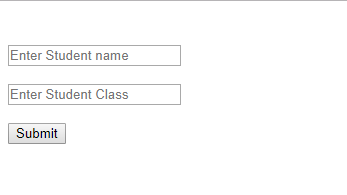
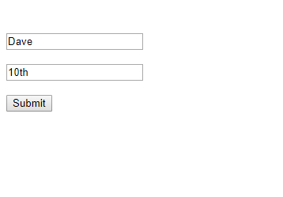
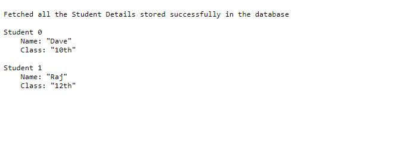
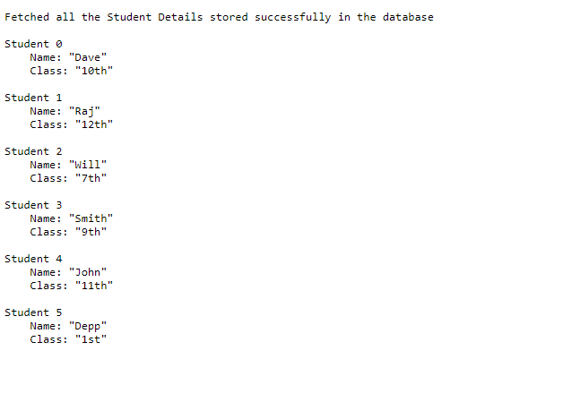

# Node JS Project with Mongo DB

## Scripts and Images 

### Main Script
```js
const http = require('http');
const fs = require('fs');
const qs = require('qs');
const MongoClient = require('mongodb').MongoClient;

// Mongo Connect
async function dbConnect (student, postCallback) {
    const url = "mongodb://localhost:27017";
    const dbname = "testmongo";
    const client = new MongoClient(url, {useNewUrlParser: true});
    // Database Connection
    try {
        // Client connections
        await client.connect();
        console.log("Connected to the Database\n");
            const db = client.db(dbname);
            const collection = db.collection('students');
            // insert the student data into the data
            await collection.insertOne(student);
            console.log("Inserted the form data into the database\n");
            // read all students from the database
            let students = await collection.find({}).toArray();
            let allStudents = [];
            students.forEach((student) => {
                allStudents.push(student.student);
            });
            console.log('Read all the student details from the database\n');
            postCallback(allStudents);
    } catch (err) {
        console.log(err);
    }
    client.close();
    console.log("Database Closed");
}

// Creating a new server to listen for requests
const server = http.createServer((req, res) => {
    // switch case to work on GET and POST request
    switch(req.method) {
        // Accepts only GET requests
        case "GET":
            // Check the url path
            if(req.url === "/") {
                sendHtmlForm(req,res);
            } else {
                res.writeHead(404, "Resource Not Found");
                res.end("<h1>Not Found<h1>");
            }
            break;
        
        // Accepts only POST requests
        case "POST":
            // Check the url path
            if(req.url === "/") {
                getPostData(req, res);
            } else {
                res.writeHead(404, "Resource Not Found");
                res.end("<h1>Not Found<h1>");
            }
            break;
        default:
            res.writeHead(405, "Method Not Supported");
            res.end("<h1>Method Not Supported</h1>");
            break;
    }
});

// send HTML Form for the GET request
function sendHtmlForm(req, res) {
    fs.readFile("form.html", (err, data) => {
        if(err) console.log(err);
        res.writeHead(200, "OK", { "Content-Type": "text/html" });
        res.write(data);
        res.end();
        console.log("Sent the HTML Form for the GET request\n");
    });
}

// Get the data from the POST request
function getPostData(req, res) {
    let body = '';
    req.on('data', (data) => {
        body += data;
        if(body.length > 1e7) {
            res.writeHead(413, "Request Entity Too Large");
            res.end("Request Entity Too Large");
        } else {
            let reqBody = qs.parse(body);
            console.log("Got the POST data(Student Details) from the Form\n");
            dbConnect(reqBody, (allStudents) => {
                res.write("\nFetched all the Student Details stored successfully in the database \n");
                allStudents.forEach((student, i) => {
                    res.write("\nStudent " + i + "\n");
                    res.write("    Name: " + JSON.stringify(student.name) + "\n");
                    res.write("    Class: " + JSON.stringify(student.class) + "\n");
                });
                console.log("Displayed back all the student data to the client\n");
                res.end();
            });
        }
    });
}

server.listen(process.env.PORT, process.env.IP, () => {
    console.log("\nServer is Up and Running\n");
});
```

### HTML Form
```html
<html>
    <head>
        <title>Student Form</title>
    </head>
    <body>
        <form action="/" method="POST">
            <br>
            <br>     
            <input type="text" name="student[name]" placeholder="Enter Student name" required>
            <br>
            <br>
            <input type="text" name="student[class]" placeholder="Enter Student Class" required>     
            <br>
            <br>
            <input type="submit"> 
        </form>
    </body>
</html>
```

### Images Collections

#### Empty Form

<p align="center">
<kbd></kbd>
</p>

#### Adding the first student

<p align="center">
<kbd></kbd>
</p>

#### Giving back the response

<p align="center">
<kbd></kbd>
</p>

#### Adding the second student

<p align="center">
<kbd></kbd>
</p>

#### Giving back the response

<p align="center">
<kbd></kbd>
</p>

#### Added some more students

<p align="center">
<kbd></kbd>
</p>

### Final Console Log for all the above events

```console
[nodemon] starting `node app.js`

Server is Up and Running

Got the POST data(Student Details) from the Form

Connected to the Database

Inserted the form data into the database

Read all the student details from the database

Displayed back all the student data to the client

Database Closed
Sent the HTML Form for the GET request

Got the POST data(Student Details) from the Form

Connected to the Database

Inserted the form data into the database

Read all the student details from the database

Displayed back all the student data to the client

Database Closed
Sent the HTML Form for the GET request

Got the POST data(Student Details) from the Form

Connected to the Database

Inserted the form data into the database

Read all the student details from the database

Displayed back all the student data to the client

Database Closed
Sent the HTML Form for the GET request

Got the POST data(Student Details) from the Form

Connected to the Database

Inserted the form data into the database

Read all the student details from the database

Displayed back all the student data to the client

Database Closed
Sent the HTML Form for the GET request

Got the POST data(Student Details) from the Form

Connected to the Database

Inserted the form data into the database

Read all the student details from the database

Displayed back all the student data to the client

Database Closed
Sent the HTML Form for the GET request

Got the POST data(Student Details) from the Form

Connected to the Database

Inserted the form data into the database

Read all the student details from the database

Displayed back all the student data to the client

Database Closed
```
