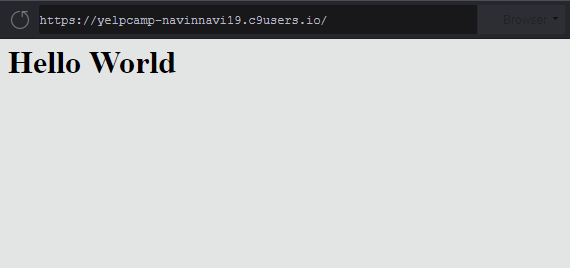
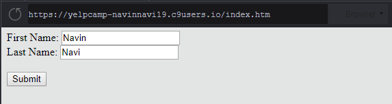
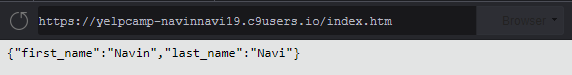
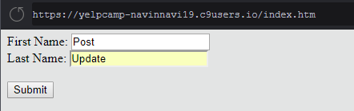
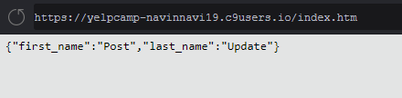
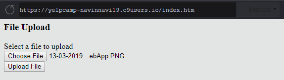
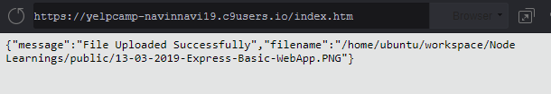
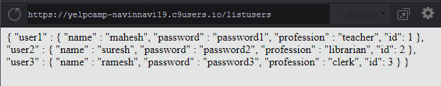
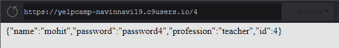

# NodeJS-L1_Training

This project is the home for my basics NodeJS L1 Training.

## Table of contents

### [Notes](##notes-taken-during-the-training-for-future-use)

- #### [Asynchronous, Non Blocking Nature](#to-test-the-asyncronous-nature)
    - [Example 1](#example-1)
    - [Example 2](#example-2)
    - [FS in Blocking Mode](#running-file-read-synchronously)
    - [FS in Non-Blocking Mode](#running-file-read-asynchronously)

- #### [Events](#subcription-and-publish-method---event-emitter)
    - [Example 1](#example-1-1)
    - [Example 2](#example-2-1)
    - [Example 3](#example-3)

- #### [Buffers](#buffers-1)
    - [Create-a-buffer-variable-using-bufwrite](#create-a-buffer-variable-using-bufwrite)
    - [Getting-the-buffer-variable-using-tostring-and-tojson-in-respective-format](#getting-the-buffer-variable-using-tostring-and-tojson-in-respective-format)
    - [Buffer-concatenation](#buffer-concatenation)
    - [Buffer-copy](#buffer-copy)
    - [Buffer-slice](#buffer-slice)

- #### [Streams](#streams-1)
    - [Create-read-stream](#create-read-stream)
    - [Create-write-stream](#create-write-stream)
    - [Pipe-read-stream-and-write-stream](#pipe-read-stream-and-write-stream)
    - [Chaining-the-streams](#chaining-the-streams)
        + [File-compress](#file-compress)
        + [File-decompress](#file-decompress)
        
- #### [File-system](#file-system-1)
    - [File-write-and-read](#file-write-and-read)
    - [File-open-read-close-and-delete](#file-open-read-close-and-delete-a-file)
    - [Directory-create-read-and-delete](#directory-create-read-and-delete)
    - [Watch Files for Changes](#watch---watch-the-file-for-any-changes)

- #### [Utility Modules](#global-objects)
    - [Basic-objects](#basic-objects)
    - [Console-utilities](#console-utilities)
    - [Process-utility](#process-utility)
    - [OS-utilities](#os-utilities)
    - [Path-utility](#path-utility)
    - [Net Module](#net-module-utility)
    - [DNS-module](#dns-module)
    - [Domain-module](#domain-module)

- #### [http Module](#http-module-1)
    - [Simple-http-setup](#simple-http-setup)
    - [Detailed-http-server-and-client-setup](#detailed-http-server-and-client-setup)

- #### [Express](#express-1)
    - [Basic Express App](#demo-basic-app)
    - [GET Form Data](#get-input-through-form)
    - [POST Form Data](#post-input-through-form)
    - [File Upload-Multer](#file-upload-using-multer)

- #### [REST](#restful-api)
    - [GET](#get-user-data)
    - [POST](#post-user-data)
    - [SHOW&UPDATE](#show-user)
    - [DELETE](#delete-request)

- #### [Child Process](#child-process-1)
    - [exec()](#childprocessexec)
    - [spawn()](#childprocessspawn)
    - [fork()](#childprocessfork)

## Notes taken during the training for future use.

### To test the Asyncronous Nature
#### Example 1
**Code**
```js
setTimeout( function(){
    console.log("I will print after 2 sec");
}, 2000);

console.log("I will be printed immediately");
```
**Output**
```shell
$ node app.js 
I will be printed immediately
I will print after 2 sec
```

### To test the Asyncronous Nature
#### Example 2
**Code**
```js
var maxTime = 1000;

var subtract = function(large, small, callback){
    var waitTime = Math.floor((Math.random()*maxTime)+1);
    if(small > large){
        setTimeout(function(){
            callback(Error("Error:Negative Result Error " + waitTime) );
        }, waitTime);
    } else {
        setTimeout(function(){
            callback(null, large-small, waitTime);
        }, waitTime);
    }
};

var handleCallback = function(error, result, time){
  if(error){
      console.log(error.message);
  } else {
      console.log("Result is " + result + " Printed at " + time);
  }
};

console.log("Calling subtract for 100 and 5");
subtract(100, 5, handleCallback);
console.log("Calling subtract for 5 and 100");
subtract(5, 100, handleCallback);
console.log("Calling subtract for 20 and 17");
subtract(20, 17, handleCallback);
console.log("Calling subtract for 17 and 20");
subtract(17, 20, handleCallback);
```
**Output 1**
```console
$ node app.js 
Calling subtract for 100 and 5
Calling subtract for 5 and 100
Calling subtract for 20 and 17
Calling subtract for 17 and 20
Error:Negative Result Error262
Result is 95 Printed at 563
Error:Negative Result Error620
Result is 3 Printed at 813
```
**Output 2**
```console
$ node app.js 
Calling subtract for 100 and 5
Calling subtract for 5 and 100
Calling subtract for 20 and 17
Calling subtract for 17 and 20
Error:Negative Result Error 111
Result is 95 Printed at 492
Error:Negative Result Error 546
Result is 3 Printed at 750
```
**Output 3**
```console
$ node app.js 
Calling subtract for 100 and 5
Calling subtract for 5 and 100
Calling subtract for 20 and 17
Calling subtract for 17 and 20
Result is 3 Printed at 220
Error:Negative Result Error 267
Error:Negative Result Error 603
Result is 95 Printed at 967
```
### Running File Read Synchronously
**Code**
```js
const fs = require("fs");
var data = fs.readFileSync("test.txt");
console.log(data.toString());
console.log("File Read Ended");
```
**Output**
```console
$ node app.js 
If you have the passion and desire to learn,
success will follow you all the time.
File Read Ended
```
##### NOTE: Since it ran in syncronous manner, console.log needs to wait till it reads the file.

### Running File Read Asynchronously
**Code**
```js
const fs = require("fs");
fs.readFile("test.txt", function(err, data){
    if(err) return console.log(err);
    console.log(data.toString());
});
console.log("File Read Ended");
```
**Output**
```console
$ node app.js 
File Read Ended
If you have the passion and desire to learn,
success will follow you all the time.
```
**[Back to TOC](#table-of-contents)**

### Subcription and Publish Method - Event Emitter
#### Example 1
**Code**
```js
var events = require("events");

const em = new events.EventEmitter();

em.on("knock", function(data){
   console.log('you knocked the door? ' + data); 
});
em.emit("knock", "Yes Navin here"); 
```
**Output**
```console
$ node app.js 
you knocked the door? Yes Navin here
```
#### Example 2
**Code**
```js
const events = require("events");
var eventEmitter = new events.EventEmitter();

var connectHandler = function connected() {
    eventEmitter.emit("processdata");
}

eventEmitter.on("processdata", function() {
    console.log("Date Processed");
});
eventEmitter.on("connected", connectHandler);

eventEmitter.emit("connected");
console.log("I will be seen at the last line");
```
**Output**
```console
$ node app.js
Date Processed
I will be seen at the last line
```
#### Example 3
**Code**
```js
var events = require('events');
var eventEmitter = new events.EventEmitter();

// listener #1
var listner1 = function listner1() {
   console.log('listner1 executed.');
};

// listener #2
var listner2 = function listner2() {
   console.log('listner2 executed.');
};

// Bind the connection event with the listner1 function
eventEmitter.addListener('connection', listner1);

// Bind the connection event with the listner2 function
eventEmitter.on('connection', listner2);

var eventListeners = require('events').EventEmitter.listenerCount(eventEmitter,'connection');
console.log(eventListeners + " Listner(s) listening to connection event");

// Fire the connection event 
eventEmitter.emit('connection');

// Remove the binding of listner1 function
eventEmitter.removeListener('connection', listner1);
console.log("Listner1 will not listen now.");

// Fire the connection event 
eventEmitter.emit('connection');

eventListeners = require('events').EventEmitter.listenerCount(eventEmitter,'connection');
console.log(eventListeners + " Listner(s) listening to connection event");

console.log("Program Ended.");
```
**Output**
```console
$ node app.js 
2 Listner(s) listening to connection event
listner1 executed.
listner2 executed.
Listner1 will not listen now.
listner2 executed.
1 Listner(s) listening to connection event
Program Ended.
```
**[Back to TOC](#table-of-contents)**

### Buffers
#### Create a buffer variable using buf.write
**Code**
```js
var buf1 = new Buffer.alloc(30);

var len = buf1.write("Simply Easy Learning");

console.log(buf1);
console.log("Buffer is `" + buf1 +  "` with length " + len);
```
**Output**
```console
$ node app.js 
<Buffer 53 69 6d 70 6c 79 20 45 61 73 79 20 4c 65 61 72 6e 69 6e 67 00 00 00 00 00 00 00 00 00 00>
Buffer is `Simply Easy Learning` with length 20
```
#### Getting the buffer variable using toString() and toJSON() in respective format
**Code**
```js
var buf = new Buffer.alloc(30);
for (var i = 0 ; i < 26 ; i ++) {
    buf[i] = i + 97;
}

console.log(buf);
console.log( buf.toString());
console.log( buf.toString('ascii', 0, 5));
console.log( buf.toJSON());
```
**Output**
```console
$ node app.js 
<Buffer 61 62 63 64 65 66 67 68 69 6a 6b 6c 6d 6e 6f 70 71 72 73 74 75 76 77 78 79 7a 00 00 00 00>
abcdefghijklmnopqrstuvwxyz
abcde
{ type: 'Buffer',
  data:
   [ 97,
     98,
     99,
     100,
     101,
     102,
     103,
     104,
     105,
     106,
     107,
     108,
     109,
     110,
     111,
     112,
     113,
     114,
     115,
     116,
     117,
     118,
     119,
     120,
     121,
     122,
     0,
     0,
     0,
     0 ] }
```

#### Buffer concatenation
**Code**
```js
var buffer1 = new Buffer.from("ABC");
var buffer2 = new Buffer.from("ABCD");
var buffer3 = Buffer.concat([buffer1, buffer2]);
console.log(buffer3.toString());
var buffer4 = buffer2.compare(buffer1);
console.log(buffer4.toString());
```
**Output**
```console
$ node app.js 
ABCABCD
1
```

#### Buffer copy
**Code**
```js
var buffer5 = new Buffer.from('ABC');
var buffer6 = new Buffer.alloc(3);
buffer5.copy(buffer6);
console.log("buffer5 content: " + buffer5.toString() + " Lenght is " + buffer5.length);
```
**Output**
```console
$ node app.js 
buffer5 content: ABC Lenght is 3
```

#### Buffer slice
**Code**
```js
var buffer7 = buf1.slice(0, 9);
console.log(buffer7.toString());
```
**Output**
```console
Simply Ea
```
**[Back to TOC](#table-of-contents)**

### Streams
#### Create Read Stream
**Code**
```js
const fs = require('fs');

var data = '';

var readStream = fs.createReadStream("test.txt");

readStream.setEncoding("UTF-8");

readStream.on("data", (chunk) => {
    data+=chunk;
});

readStream.on("end", () => {
    console.log(data);
});

readStream.on("error", (err) => {
    console.log(err.stack);
}); 

console.log("Program Ended");
```
**Output**
```console
// Read the file from test.txt
$ node app.js 
Tutorials Point is giving self learning content 
to teach the world in simple and easy way !!
Program Ended
```

#### Create Write Stream
**Code**
```js
const fs = require('fs');

var data = 'Tutorials Point is giving self learning content to teach the world in simple and easy way !!';

var writeStream = fs.createWriteStream("test.txt");

writeStream.write(data, "UTF-8");

writeStream.end();

writeStream.on("finish", () => {
    console.log("Wrote to the file successfully");
});

writeStream.on("error", (err) => {
    console.log(err.stack);
}); 

console.log("Program Ended");
```
**Output**
```console
$ node app.js 
Program Ended
Wrote to the file successfully
```

#### Pipe read stream and write stream
**Code**
```js
const fs = require('fs');

var readStream = fs.createReadStream('input.txt');
var writeStream = fs.createWriteStream('output.txt');

readStream.pipe(writeStream);

console.log("Program End")
```
**Output**
```console
Program End
// Background: File successfully read and wrote to the output file.
```

#### Chaining the streams
##### File Compress
**Code**
```js
const fs = require('fs');
const zlib = require('zlib');

fs.createReadStream('input.txt')
    .pipe(zlib.createGzip())
    .pipe(fs.createWriteStream('input.tar.gz'));
console.log("File Compressed");
```
**Output**
```console
File Compressed
```

##### File Decompress
**Code**
```js
const fs = require('fs');
const zlib = require('zlib');

fs.createReadStream('input.tar.gz')
    .pipe(zlib.createGunzip())
    .pipe(fs.createWriteStream('gununzippedinput.txt'));
console.log("File Decompressed");
```
**Output**
```console
File Decompressed
```
**[Back to TOC](#table-of-contents)**

### File System
#### Finding the File Stats
**Code**
```js
const fs = require("fs");

console.log("Openinng the file Now");
fs.stat("input.txt", (err, data) => {
    if(err) console.log(err);
    console.log(data);
    console.log("Is file?" + data.isFile());
    console.log("Is directory?" + data.isDirectory());
});
```
**Output**
```console
$ node app.js 
Openinng the file Now
Stats {
  dev: 2097281,
  mode: 33188,
  nlink: 1,
  uid: 1000,
  gid: 1000,
  rdev: 0,
  blksize: 4096,
  ino: 266,
  size: 92,
  blocks: 8,
  atimeMs: 1552051779342.2166,
  mtimeMs: 1551878552664.6455,
  ctimeMs: 1551878552664.6455,
  birthtimeMs: 1551878552664.6455,
  atime: 2019-03-08T13:29:39.342Z,
  mtime: 2019-03-06T13:22:32.665Z,
  ctime: 2019-03-06T13:22:32.665Z,
  birthtime: 2019-03-06T13:22:32.665Z }
Is file?true
Is directory?false
```

#### File write and read
**Code**
```js
const fs = require("fs");

console.log("Creating a write Operation");
fs.writeFile("output.txt", "Simple Easy Learning",(err) => {
    if(err) console.log(err);
    console.log("File written Successfully");
    console.log("Now lets read that file");
    fs.readFile("output.txt", (err, data) => {
        if(err) console.log(err);
        console.log(data.toString());
        console.log("File read successfully");
    });
});
```
**Output**
```console
 $ node app.js 
Creating a write Operation
File written Successfully
Now lets read that file
Simple Easy Learning
File read successfully
```

#### File Open, Read, Close and Delete
##### Example 1
**Code**
```js
const fs = require("fs");
const buf = new Buffer.alloc(256);

console.log("Creating a write Operation");
// File Open
console.log("Going to Open the file");
fs.open("input.txt", "r+", (err, fd) => {
    if(err) console.log(err);
    console.log('File Open Successfully');
    console.log("Going to truncate the file after 10 bytes");
    fs.ftruncate(fd, 10, (err) => {
        if(err) console.log(err);
        // File Read
        console.log("Going to read the Opened file");
        fs.read(fd, buf, 0, buf.length, 0, (err, data) => {
            if(err) console.log(err);
            console.log("Bytes read: " + data);
            console.log("File Read Successfully");
            if (data > 0) {
                console.log(buf.slice(0, data).toString());
            }
            // File Close
            console.log("Going to close the file");
            fs.close(fd, (err) => {
                if(err) console.log(err);
                console.log("File closed Successfully");
                // File Delete
                console.log("Going to delete a file");
                fs.unlink("output.txt", (err) => {
                    if(err) console.log(err);
                    console.log("File deleted successfully");
                });
            });
        });
    });
});
```
**Output**
```console
$ node app.js 
Creating a write Operation
Going to Open the file
File Open Successfully
Going to truncate the file after 10 bytes
Going to read the Opened file
Bytes read: 10
File Read Successfully
Tutorials 
Going to close the file
File closed Successfully
Going to delete a file
File deleted successfully
```
##### Example 2
**Code**
```js
const fs = require('fs');

fs.exists('foo.txt', (exists) => {
    if(exists) {
        fs.stat('foo.txt', (err, stats) => {
            console.log(stats);
            if(err) console.log(err);
            fs.open('foo.txt', 'r', (err, fd) => {
                if(err) console.log(err);
                const buffer = new Buffer.alloc(stats.size);
                fs.read(fd, buffer, 0, buffer.length, null, (err, bytesRead, buffer) => {
                    if(err) console.log(err);
                    console.log(buffer.toString('utf-8', 0, buffer.length));
                    fs.close(fd, (err) => {
                        if(err) console.log(err);
                    });
                });
            });
        });
    }
});
```
**Output**
```console
$ node fs.js 
foo bar foo foo foo foo bar bar bar foo
```

#### Directory Create, read and delete
**Code**
```js
const fs = require('fs');
// Create a new Directory
console.log('Going to create a directory ./test/tmp');
fs.mkdir("./test/tmp", (err) => {
    if(err) console.log(err);
    console.log("/test/tmp directory was created");
    // Read the contents of a Directory
    console.log("Going to read the contents of a directory ./test");
    fs.readdir("./test", (err, files) => {
        if(err) console.log(err);
        console.log(files);
        console.log("Files inside a directory ./test was read");
        // Delete a Directory
        console.log("Going to delete the directory ./test/tmp");
        fs.rmdir("./test/tmp", (err) => {
            if(err) console.log(err);
            console.log("Deleted the directory ./test/tmp");
        });
    });
});
```
**Output**
```console
 $ node app.js 
Going to create a directory ./test/tmp
/test/tmp directory was created
Going to read the contents of a directory ./test
[ 'app.js',
  'input.txt',
  'package-lock.json',
  'package.json',
  'test.js',
  'tmp' ]
Files inside a directory ./test was read
Going to delete the directory ./test/tmp
Deleted the directory ./test/tmp
```
#### watch() - Watch the file for any changes
**Code**
```js
const fs = require('fs');
var filename = 'test.txt';

fs.watch(filename, { persistent: true }, (err, event) => {
    if(err) console.log(err);
    console.log(event + " event occured on " + filename)
});
```
**Console Log**
```console
$ node app.js 
rename
test.txt event occured on test.txt
change
test.txt event occured on test.txt
rename
test.txt event occured on test.txt
rename
test.txt event occured on test.txt
```
**[Back to TOC](#table-of-contents)**

### Global Objects
#### Basic objects
**Code**
```js
console.log(__filename);
console.log(__dirname);
function hello(){
    console.log("Hello World");
}

var t = setTimeout(hello, 2000);
clearTimeout(t);

var i = setInterval(hello, 1000);
setTimeout(() => {
    clearInterval(i);
    }, 4000);
```
**Output**
```console
$ node app.js 
/home/ubuntu/workspace/Node Learnings/app.js
/home/ubuntu/workspace/Node Learnings
Hello World
Hello World
Hello World
```
#### Console Utilities
**Code**
```js
console.info("Program Started");

console.time("Getting data");

console.log("Get the counter value");
var counter = 10;
console.log("Counter: %d", counter);

setTimeout(() => {
    console.log(__dirname);
}, 2000);

console.timeEnd('Getting data');

console.info("Program Ended");
```
**Output**
```console
$ node app.js 
Program Started
Get the counter value
Counter: 10
Getting data: 1.112ms
Program Ended
/home/ubuntu/workspace/Node Learnings
```

#### Process Utility
**Code**
```js
process.on("exit", (code) => {
    setTimeout(() => {
        console.log("Will i be executed");
    },2000);
    console.log("I will be executed but with exit code: ", code);
});

process.stdout.write("Program ended!" + "\n");

process.argv.forEach ((val, index, array) => {
    console.log(index, ":", val);
});

console.log("Current Directory: " + process.cwd());
console.log("Node Version: " + process.version);
console.log("Process Execution Path: " + process.execPath);
console.log("Windows Platform " + process.platform + " with archietecture: " +process.arch);
console.log("Memory Usage");
console.log(process.memoryUsage());
```
**Output**
```console
$ node app.js 
Program ended!
0 ':' '/home/ubuntu/.nvm/versions/node/v10.15.2/bin/node'
1 ':' '/home/ubuntu/workspace/Node Learnings/app.js'
Current Directory: /home/ubuntu/workspace/Node Learnings
Node Version: v10.15.2
Process Execution Path: /home/ubuntu/.nvm/versions/node/v10.15.2/bin/node
Windows Platform linux with archietecture: x64
Memory Usage
{ rss: 30048256,
  heapTotal: 6537216,
  heapUsed: 3892024,
  external: 8272 }
I will be executed but with exit code:  0
```
#### OS Utilities
**Code**
```js
var os = require('os');

console.log("Endianness: " + os.endianness());
console.log("OS Type: " + os.type());
console.log("OS Platform: " + os.platform());
console.log("OS hostname: " + os.hostname());
console.log("OS Arch: " + os.arch());
console.log("OS Release: " + os.release());
console.log("OS Uptime: " + os.uptime() + " ms");
console.log("OS Total Memory: " + os.freemem() + " bytes");
console.log("OS Total Memory: " + os.freemem() + " bytes");
console.log("OS CPU's: ");
for(var i = 0; i < os.cpus().length; i++){
    console.table(os.cpus()[i]);
}
```
**Output**
```console
$ node app.js 
Endianness: LE
OS Type: Linux
OS Platform: linux
OS hostname: navinnavi19-yelpcamp-6787935
OS Arch: x64
OS Release: 4.9.120-c9
OS Uptime: 4703789 ms
OS Total Memory: 4253593600 bytes
OS Total Memory: 4253593600 bytes
OS CPU's: 
┌─────────┬────────────┬───────────┬────────────┬─────────────┬─────┬──────────────────────────────────┐
│ (index) │    user    │   nice    │    sys     │    idle     │ irq │              Values              │
├─────────┼────────────┼───────────┼────────────┼─────────────┼─────┼──────────────────────────────────┤
│  model  │            │           │            │             │     │ 'Intel(R) Xeon(R) CPU @ 2.50GHz' │
│  speed  │            │           │            │             │     │               2500               │
│  times  │ 3751155800 │ 128819600 │ 1871675100 │ 39943620800 │  0  │                                  │
└─────────┴────────────┴───────────┴────────────┴─────────────┴─────┴──────────────────────────────────┘
┌─────────┬────────────┬───────────┬────────────┬─────────────┬─────┬──────────────────────────────────┐
│ (index) │    user    │   nice    │    sys     │    idle     │ irq │              Values              │
├─────────┼────────────┼───────────┼────────────┼─────────────┼─────┼──────────────────────────────────┤
│  model  │            │           │            │             │     │ 'Intel(R) Xeon(R) CPU @ 2.50GHz' │
│  speed  │            │           │            │             │     │               2500               │
│  times  │ 4259957300 │ 148453200 │ 1848524500 │ 39772681800 │  0  │                                  │
└─────────┴────────────┴───────────┴────────────┴─────────────┴─────┴──────────────────────────────────┘
┌─────────┬────────────┬───────────┬────────────┬─────────────┬─────┬──────────────────────────────────┐
│ (index) │    user    │   nice    │    sys     │    idle     │ irq │              Values              │
├─────────┼────────────┼───────────┼────────────┼─────────────┼─────┼──────────────────────────────────┤
│  model  │            │           │            │             │     │ 'Intel(R) Xeon(R) CPU @ 2.50GHz' │
│  speed  │            │           │            │             │     │               2500               │
│  times  │ 4247773300 │ 124769300 │ 1856185500 │ 39875602600 │  0  │                                  │
└─────────┴────────────┴───────────┴────────────┴─────────────┴─────┴──────────────────────────────────┘
┌─────────┬────────────┬───────────┬────────────┬─────────────┬─────┬──────────────────────────────────┐
│ (index) │    user    │   nice    │    sys     │    idle     │ irq │              Values              │
├─────────┼────────────┼───────────┼────────────┼─────────────┼─────┼──────────────────────────────────┤
│  model  │            │           │            │             │     │ 'Intel(R) Xeon(R) CPU @ 2.50GHz' │
│  speed  │            │           │            │             │     │               2500               │
│  times  │ 4235801100 │ 119870600 │ 1850291200 │ 39912080900 │  0  │                                  │
└─────────┴────────────┴───────────┴────────────┴─────────────┴─────┴──────────────────────────────────┘
┌─────────┬────────────┬───────────┬────────────┬─────────────┬─────┬──────────────────────────────────┐
│ (index) │    user    │   nice    │    sys     │    idle     │ irq │              Values              │
├─────────┼────────────┼───────────┼────────────┼─────────────┼─────┼──────────────────────────────────┤
│  model  │            │           │            │             │     │ 'Intel(R) Xeon(R) CPU @ 2.50GHz' │
│  speed  │            │           │            │             │     │               2500               │
│  times  │ 3611399900 │ 113859300 │ 1810261200 │ 40589188300 │  0  │                                  │
└─────────┴────────────┴───────────┴────────────┴─────────────┴─────┴──────────────────────────────────┘
┌─────────┬────────────┬───────────┬────────────┬─────────────┬─────┬──────────────────────────────────┐
│ (index) │    user    │   nice    │    sys     │    idle     │ irq │              Values              │
├─────────┼────────────┼───────────┼────────────┼─────────────┼─────┼──────────────────────────────────┤
│  model  │            │           │            │             │     │ 'Intel(R) Xeon(R) CPU @ 2.50GHz' │
│  speed  │            │           │            │             │     │               2500               │
│  times  │ 3574358300 │ 112223800 │ 1791024700 │ 40645772700 │  0  │                                  │
└─────────┴────────────┴───────────┴────────────┴─────────────┴─────┴──────────────────────────────────┘
┌─────────┬────────────┬───────────┬────────────┬─────────────┬─────┬──────────────────────────────────┐
│ (index) │    user    │   nice    │    sys     │    idle     │ irq │              Values              │
├─────────┼────────────┼───────────┼────────────┼─────────────┼─────┼──────────────────────────────────┤
│  model  │            │           │            │             │     │ 'Intel(R) Xeon(R) CPU @ 2.50GHz' │
│  speed  │            │           │            │             │     │               2500               │
│  times  │ 3520978200 │ 110602900 │ 1791243200 │ 40725366700 │  0  │                                  │
└─────────┴────────────┴───────────┴────────────┴─────────────┴─────┴──────────────────────────────────┘
┌─────────┬────────────┬───────────┬────────────┬─────────────┬─────┬──────────────────────────────────┐
│ (index) │    user    │   nice    │    sys     │    idle     │ irq │              Values              │
├─────────┼────────────┼───────────┼────────────┼─────────────┼─────┼──────────────────────────────────┤
│  model  │            │           │            │             │     │ 'Intel(R) Xeon(R) CPU @ 2.50GHz' │
│  speed  │            │           │            │             │     │               2500               │
│  times  │ 3405881200 │ 111445200 │ 1791322600 │ 40849828300 │  0  │                                  │
└─────────┴────────────┴───────────┴────────────┴─────────────┴─────┴──────────────────────────────────┘
```

#### Path Utility
**Code**
```js
var path = require("path");

// Normalization
console.log('normalization : ' + path.normalize('/test/test1//2slashes/1slash/tab/..'));

// Join
console.log('join path : ' + path.join('/test', 'test1', '2slashes/1slash', 'tab', '..'));

// Resolve
console.log('resolve : ' + path.resolve('app.js'));

// extName
console.log('ext name : ' + path.extname('app.js'));
```
**Output**
```console
$ node app.js 
normalization : /test/test1/2slashes/1slash
joint path : /test/test1/2slashes/1slash
resolve : /home/ubuntu/workspace/Node Learnings/app.js
ext name : .js
```

#### Net Module Utility
##### Server code
**Code**
```js
const net = require('net');

const server = net.createServer(function(connection){
    console.log('client connected');
    connection.on("end", () => {
        console.log("Client Disconnected");
    });
    connection.write("Hello World!\r\n");
    connection.write("You are connected to the server now\r\n");
});

server.listen(8080, () => {
    console.log("Server is listening");
});
```
**Output**
```console
$ node server.js 
Server is listening
client connected
Client Disconnected
```
##### Clients code
**Code**
```js
const net = require('net');

const client = net.connect({port: 8080}, () => {
    console.log("Connected to the server");
});

client.on("data", (data) => {
    console.log(data.toString());
    client.end();
});

client.on("end", () => {
    console.log("Disconnected from the server");
});
```
**Output**
```console
$ node client.js 
Connected to the server
Hello World!
You are connected to the server now

Disconnected from the server
```

#### DNS Module
**Code**
```js
var dns = require("dns");

dns.lookup("google.com", (err, address, family) => {
    if(err) console.log(err);
    console.log("address: " + address);
    dns.reverse(address, (err, hostname) => {
        if(err) console.log(err);
        console.log("reverse for address: " + address + " is " + hostname);
    });
});
```
**Output**
```console
$ node app.js 
address: 74.125.203.102
reverse for address: 74.125.203.102 is th-in-f102.1e100.net
```

#### Domain Module
**Code**
```js
const eventEmitter = require('events').EventEmitter;
const domain = require('domain');

var emitter1 = new eventEmitter();
var domain1 = domain.create();

domain1.on("error", (err) => {
    console.log("Domain 1 handled this error (" + err.message + ")");
});
// Explicit Binding
domain1.add(emitter1);

emitter1.on("error", (err) => {
    console.log("Listener handled this error (" + err.message + ")");
});

emitter1.emit("error", new Error("To be handled by the listener"));
emitter1.removeAllListeners("error");
emitter1.emit("error", new Error("To be handled by the domain1"));

var domain2 = domain.create();

domain2.on("error", (err) => {
    console.log("Domain 2 handled this error (" + err.message + ")");
});
// Implicit Binding
domain2.run( () => {
    var emitter2 = new eventEmitter();
    emitter2.emit("error", new Error("To be handled by the domain 2"));
});

domain1.remove(emitter1);
emitter1.emit("error", new Error("Converted to exception, System will crash"));
```
**Output**
```console
$ node app.js node app.js 
Listener handled this error (To be handled by the listener)
Domain 1 handled this error (To be handled by the domain1)
Domain 2 handled this error (To be handled by the domain 2)
events.js:174
      throw er; // Unhandled 'error' event
      ^

Error: Converted to exception, System will crash
    at Object.<anonymous> (/home/ubuntu/workspace/Node Learnings/app.js:33:24)
    at Module._compile (internal/modules/cjs/loader.js:689:30)
    at Object.Module._extensions..js (internal/modules/cjs/loader.js:700:10)
    at Module.load (internal/modules/cjs/loader.js:599:32)
    at tryModuleLoad (internal/modules/cjs/loader.js:538:12)
    at Function.Module._load (internal/modules/cjs/loader.js:530:3)
    at Function.Module.runMain (internal/modules/cjs/loader.js:742:12)
    at startup (internal/bootstrap/node.js:283:19)
    at bootstrapNodeJSCore (internal/bootstrap/node.js:743:3)
Emitted 'error' event at:
    at Object.<anonymous> (/home/ubuntu/workspace/Node Learnings/app.js:33:10)
    at Module._compile (internal/modules/cjs/loader.js:689:30)
    [... lines matching original stack trace ...]
    at bootstrapNodeJSCore (internal/bootstrap/node.js:743:3)
```
**[Back to TOC](#table-of-contents)**

### http module
#### Simple http setup
**Code**
```js
const http = require('http');
const port = process.env.PORT;
http.createServer(function(req, res){
    res.writeHead(200, {'Content-Type': "text/plain"});
    res.end("Hello World");
}).listen(port);

console.log("Server is running at " + port);
```
**Output**
```console
Hello World
```

#### Detailed http server and client setup
##### server.js
**Code**
```js
const http = require('http');
const fs = require('fs');
const url = require('url');

// Create a server
http.createServer((req, res) => {

   // Parse the request containing file name
    var pathname = url.parse(req.url).pathname;

    // Print the name of the file for which request is made.
    console.log("Request for " + pathname + " received.");

    // Read the requested file content from file system
    fs.readFile(pathname.substr(1), (err, data) => {
        if(err) {
            console.log(err);
            
            // HTTP Status: 404 : NOT FOUND
            // Content Type: text/plain
            res.writeHead(404, { 'Content-Type': 'text/html' });
        } else {
            //Page found	  
            // HTTP Status: 200 : OK
            // Content Type: text/plain
            res.writeHead(200, { 'Content-Type': 'text/html' });
            // Write the content of the file to response body
            res.write(data.toString());
        }
        // Send the response body 
        res.end();
    });
}).listen(process.env.PORT, process.env.IP);

// Console will print the message
console.log("Server is running at local host");
```
**Output**
```console
$ node server.js 
Server is running at local host
Request for /index.htm received.
```
##### client.js
**Code**
```js
const http = require('http');

// Options to be used by request 
var options = {
   host: process.env.IP,
   port: process.env.PORT,
   path: '/index.htm'  
};

// Callback function is used to deal with response
var callback = (response) => {
   // Continuously update stream with data
   var body = '';
   response.on('data', (data) => {
      body += data;
   });
   
   response.on('end', () => {
      // Data received completely.
      console.log(body);
   });
};
// Make a request to the server
var req = http.request(options, callback);
req.end();
```
**Output**
```console
$ node client.js 
<html>
    <head>
        <title>Sample Page</title>
    </head>
    <body>
        <h1>Hello World</h1>
    </body>
</html>
```

#### More Examples
```js
const http = require('http');
const fs = require('fs');

http.createServer((request, response) => {
        const { headers, method, url } = request;
          let body = [];
          request.on('error', (err) => {
            console.error(err);
          }).on('data', (chunk) => {
            body.push(chunk);
          }).on('end', () => {
            body = Buffer.concat(body).toString();
            response.on('error', (err) => {
              console.error(err);
            });
        
            response.writeHead(200, {'Content-Type': 'application/json'});
        
            const responseBody = { headers, method, url, body };
        
            response.write(JSON.stringify(responseBody));
            response.end();
        
          });
}).listen(process.env.PORT, process.env.IP);
```

**[Back to TOC](#table-of-contents)**

### Express
#### Demo Basic App
**Code**
```js
const express = require("express");
const app = express();

app.use('/', (req, res) => {
    res.send("<h1> Hello World <h1>");
});

var server = app.listen(process.env.PORT, process.env.IP, () => {
    var host = server.address().address;
    var port = server.address().port;
    console.log("Example app listening at https://%s:%s", host, port);
});
```
**Output**
```console
$ node index.js 
Example app listening at https://0.0.0.0:8080
```
<p align="center">
<kbd></kbd>
</p>

#### GET input through Form
**Code**
##### index.js
```js
const express = require("express");

const app = express();

app.use(express.static('public'));

app.get("/index.htm", (req, res) => {
    res.sendFile(__dirname + "/" + "index.htm");
});

app.get("/process_get", (req, res) => {
    var response = {
        first_name: req.query.first_name,
        last_name: req.query.last_name
    };
    console.log(response);
    res.send(response);
});

var server = app.listen(process.env.PORT, process.env.IP, () => {
    var host = server.address().address;
    var port = server.address().port;
    console.log("Example app listening at https://%s:%s", host, port);
});
```
##### index.htm
```html
<html>
    <body>
        <form action="/process_get" method="GET">
            First Name: <input type="text" name="first_name"/> <br>
            Last Name: <input type="text" name="last_name"/> <br> <br>
            <input type="submit" value="Submit"/>
        </form>
    </body>
</html>
```
**Output**
```console
[nodemon] starting `node index.js`
Example app listening at https://0.0.0.0:8080
{ first_name: 'Navin', last_name: 'Navi' }
```
##### Request
<p align="center">
<kbd></kbd>
</p>
##### Response
<p align="center">
<kbd></kbd>
</p>

#### POST input through Form
**Code**
##### index.js
```js
const express = require("express");
const bodyParser = require("body-parser");

const app = express();

app.use(express.static('public'));
app.use(bodyParser.urlencoded({ extended: true}));

app.get("/index.htm", (req, res) => {
    res.sendFile(__dirname + "/" + "index.htm");
});

app.post("/process_post", (req, res) => {
    var response = {
        first_name: req.body.first_name,
        last_name: req.body.last_name
    };
    console.log(response);
    res.send(response);
});

var server = app.listen(process.env.PORT, process.env.IP, () => {
    var host = server.address().address;
    var port = server.address().port;
    console.log("Example app listening at https://%s:%s", host, port);
});
```
##### index.htm
```html
<html>
    <body>
        <form action="/process_post" method="POST">
            First Name: <input type="text" name="first_name"/> <br>
            Last Name: <input type="text" name="last_name"/> <br> <br>
            <input type="submit" value="Submit"/>
        </form>
    </body>
</html>
```
**Output**
```console
$ node index.js 
Example app listening at https://0.0.0.0:8080
{ first_name: 'Post', last_name: 'Update' }
```
##### Request
<p align="center">
<kbd></kbd>
</p>
##### Response
<p align="center">
<kbd></kbd>
</p>

#### File upload using multer
**Code**
##### index.js
```js
const express = require("express");
const bodyParser = require("body-parser");
const multer = require("multer");
const fs = require("fs");

const app = express();
const uploads = multer({ dest: "public/"})

app.use(express.static('public'));
app.use(bodyParser.urlencoded({ extended: true}));

app.post("/file_upload", uploads.single("file"), (req, res) => {
    console.log(req.file);
    var file = __dirname + "/public/" + req.file.originalname;
    fs.readFile(req.file.path, (err, data) => {
        if(err) {
            console.log(err);
        } else {
            fs.writeFile(file, data, (err) => {
                if(err) {
                    console.log(err);
                } else {
                    var response = {
                        message: "File Uploaded Successfully",
                        filename: file
                    };
                }
                console.log(response);
                res.send(response);
                fs.unlink(req.file.path, (err) => {
                    if(err) console.log(err);
                });
            });
        }
            
    });
});

var server = app.listen(process.env.PORT, process.env.IP, () => {
    var host = server.address().address;
    var port = server.address().port;
    console.log("Example app listening at https://%s:%s", host, port);
});
```
##### index.htm
```html
<html>
    <title>File Upload Form</title>
    <body>
        <h3>File Upload</h3>
        Select a file to upload <br>
        
        <form action="/file_upload" method="POST" enctype="multipart/form-data">
            <input type="file" name="file" size="50"> 
            <br>
            <input type="submit" value="Upload File">
        </form>
    </body>
</html>
```
**Output**
```console
$ node index.js 
Example app listening at https://0.0.0.0:8080
{ fieldname: 'file',
  originalname: '13-03-2019-Express-Basic-WebApp.PNG',
  encoding: '7bit',
  mimetype: 'image/png',
  destination: 'public/',
  filename: 'da6d975ab3615612d5ba17a82fa9c8cf',
  path: 'public/da6d975ab3615612d5ba17a82fa9c8cf',
  size: 5960 }
{ message: 'File Uploaded Successfully',
  filename:
   '/home/ubuntu/workspace/Node Learnings/public/13-03-2019-Express-Basic-WebApp.PNG' }
```
##### Request
<p align="center">
<kbd></kbd>
</p>
##### Response
<p align="center">
<kbd></kbd>
</p>

**[Back to TOC](#table-of-contents)**

### RESTful API
#### GET User Data
**Code**
```js
const express = require("express");
const fs = require("fs");

const app = express();

app.get("/listusers", (req, res) => {
    fs.readFile(__dirname + "/" + "users.json", 'utf8', (err, data) => {
        if(err) console.log(err);
        console.log(data);
        res.send(data);
    });
});

var server = app.listen(process.env.PORT, process.env.IP, () => {
    var host = server.address().address;
    var port = server.address().port;
    console.log("Example app listening at https://%s:%s", host, port);
});
```
##### users.json
```json
{
   "user1" : {
      "name" : "mahesh",
      "password" : "password1",
      "profession" : "teacher",
      "id": 1
   },
   
   "user2" : {
      "name" : "suresh",
      "password" : "password2",
      "profession" : "librarian",
      "id": 2
   },
   
   "user3" : {
      "name" : "ramesh",
      "password" : "password3",
      "profession" : "clerk",
      "id": 3
   }
}
```
**Output**
```console
$ node index.js 
Example app listening at https://0.0.0.0:8080
{
   "user1" : {
      "name" : "mahesh",
      "password" : "password1",
      "profession" : "teacher",
      "id": 1
   },
   
   "user2" : {
      "name" : "suresh",
      "password" : "password2",
      "profession" : "librarian",
      "id": 2
   },
   
   "user3" : {
      "name" : "ramesh",
      "password" : "password3",
      "profession" : "clerk",
      "id": 3
   }
}
```
##### Response
<p align="center">
<kbd></kbd>
</p>

#### POST User Data
**Code**
```js
const express = require("express");
const fs = require("fs");

const app = express();

var user = {
    "user4" : {
      "name" : "mohit",
      "password" : "password4",
      "profession" : "teacher",
      "id": 4
   }
};

app.post("/addUser", (req, res) => {
    fs.readFile(__dirname + "/" + "users.json", 'utf8', (err, data) => {
        if(err) console.log(err);
        data = JSON.parse(data);
        data["user4"] = user["user4"];
        console.log(data);
        res.send(JSON.stringify(data));
    });
});

var server = app.listen(process.env.PORT, process.env.IP, () => {
    var host = server.address().address;
    var port = server.address().port;
    console.log("Example app listening at https://%s:%s", host, port);
});
```
##### POST Request
```console
$ http POST https://yelpcamp-navinnavi19.c9users.io/addUser
HTTP/1.1 200 OK
X-BACKEND: apps-proxy
content-length: 316
content-type: text/html; charset=utf-8
date: Wed, 13 Mar 2019 14:24:57 GMT
etag: W/"13c-+vy7D7y9B167zG/Ak/sKd1RKlCk"
x-powered-by: Express

{"user1":{"name":"mahesh","password":"password1","profession":"teacher","id":1},"user2":{"name":"suresh","password":"password2","profession":"librarian","id":2},"user3":{"name":"ramesh","password":"password3","profession":"clerk","id":3},"user4":{"name":"mohit","password":"password4","profession":"teacher","id":4}}
```

**Console Log**
```console
$ node index.js 
Example app listening at https://0.0.0.0:8080
{ user1:
   { name: 'mahesh',
     password: 'password1',
     profession: 'teacher',
     id: 1 },
  user2:
   { name: 'suresh',
     password: 'password2',
     profession: 'librarian',
     id: 2 },
  user3:
   { name: 'ramesh',
     password: 'password3',
     profession: 'clerk',
     id: 3 },
  user4:
   { name: 'mohit',
     password: 'password4',
     profession: 'teacher',
     id: 4 } }
```
##### UPDATED users.json
```json
{"user1":{"name":"mahesh","password":"password1","profession":"teacher","id":1},"user2":{"name":"suresh","password":"password2","profession":"librarian","id":2},"user3":{"name":"ramesh","password":"password3","profession":"clerk","id":3},"user4":{"name":"mohit","password":"password4","profession":"teacher","id":4}}
```

#### SHOW User
**Code**
```js
const express = require("express");
const fs = require("fs");

const app = express();

app.get("/:id", (req, res) => {
    fs.readFile(__dirname + "/" + "users.json", 'utf8', (err, data) => {
        if(err) console.log(err);
        data = JSON.parse(data);
        var users = data;
        var user = users["user" + req.params.id];
        console.log(user);
        res.send(JSON.stringify(user));
    });
});

var server = app.listen(process.env.PORT, process.env.IP, () => {
    var host = server.address().address;
    var port = server.address().port;
    console.log("Example app listening at https://%s:%s", host, port);
});
```
##### users.json
```json
{"user1":{"name":"mahesh","password":"password1","profession":"teacher","id":1},"user2":{"name":"suresh","password":"password2","profession":"librarian","id":2},"user3":{"name":"ramesh","password":"password3","profession":"clerk","id":3},"user4":{"name":"mohit","password":"password4","profession":"teacher","id":4}}
```

**Console Log**
```console
$ node index.js 
Example app listening at https://0.0.0.0:8080
{ name: 'mohit',
  password: 'password4',
  profession: 'teacher',
  id: 4 }
```

##### GET Request
<p align="center">
<kbd></kbd>
</p>

#### DELETE Request
**Code**
```js
const express = require("express");
const fs = require("fs");

const app = express();

app.delete("/deleteUser/:id", (req, res) => {
    fs.readFile(__dirname + "/" + "users.json", 'utf8', (err, data) => {
        if(err) console.log(err);
        data = JSON.parse(data);
        delete data["user" + req.params.id]
        console.log(data);
        res.send(JSON.stringify(data));
    });
});

var server = app.listen(process.env.PORT, process.env.IP, () => {
    var host = server.address().address;
    var port = server.address().port;
    console.log("Example app listening at https://%s:%s", host, port);
});
```

##### users.json
```json
{"user1":{"name":"mahesh","password":"password1","profession":"teacher","id":1},"user2":{"name":"suresh","password":"password2","profession":"librarian","id":2},"user3":{"name":"ramesh","password":"password3","profession":"clerk","id":3},"user4":{"name":"mohit","password":"password4","profession":"teacher","id":4}}
```

##### Request
```console
$ http DELETE https://yelpcamp-navinnavi19.c9users.io/deleteUser/4
HTTP/1.1 200 OK
X-BACKEND: apps-proxy
content-length: 238
content-type: text/html; charset=utf-8
date: Wed, 13 Mar 2019 15:14:15 GMT
etag: W/"ee-NDAWYEHx0zJCNAZcRcu2f/VLuZ8"
x-powered-by: Express

{"user1":{"name":"mahesh","password":"password1","profession":"teacher","id":1},"user2":{"name":"suresh","password":"password2","profession":"librarian","id":2},"user3":{"name":"ramesh","password":"password3","profession":"clerk","id":3}}
```
**Console Log**
```console
$ node index.js 
Example app listening at https://0.0.0.0:8080
{ user1:
   { name: 'mahesh',
     password: 'password1',
     profession: 'teacher',
     id: 1 },
  user2:
   { name: 'suresh',
     password: 'password2',
     profession: 'librarian',
     id: 2 },
  user3:
   { name: 'ramesh',
     password: 'password3',
     profession: 'clerk',
     id: 3 } }
```

**[Back to TOC](#table-of-contents)**

### Child Process
#### childProcess.exec()
**Code**
##### support.js
```js
console.log("Child Process " + process.argv[2] + " executed");
```
##### master.js
```js
const fs = require('fs');
const childProcess = require('child_process');

for(var i=0; i < 3; i++) {
    var workerProcess = childProcess.exec("node support.js " + i, (error, stdout, stderr) => {
        if(error) {
            console.log(error.stack);
            console.log("Error Code", error.code);
            console.log("Signal Received", error.signal);
        } else {
            console.log("stdout:" + stdout);
            console.log("stderr:" + stderr);
        }
    });
    workerProcess.on("exit", (code) => {
        console.log("Child Process exited with EXIT Code %s", code);
    })
}
```
**Console Log**
```console
$ node master.js 
Child Process exited with EXIT Code 0
stdout:Child Process 0 executed

stderr:
Child Process exited with EXIT Code 0
stdout:Child Process 1 executed

stderr:
Child Process exited with EXIT Code 0
stdout:Child Process 2 executed

stderr:
```

#### childProcess.spawn()
**Code**
##### support.js
```js
console.log("Child Process " + process.argv[2] + " executed");
```
##### master.js
```js
const fs = require('fs');
const childProcess = require('child_process');

for(var i=0; i < 3; i++) {
    var workerProcess = childProcess.spawn("node", ['support.js', i]);
    
    workerProcess.stdout.on("data", (data) => {
        console.log("stdout:", data.toString());
    });
    workerProcess.stderr.on("data", (data) => {
        console.log("stderr:", data.toString());
    });

    workerProcess.on("exit", (code) => {
        console.log("Child Process exited with EXIT Code %s", code);
    });
}
```
**Console Log**
```console
$ node master.js 
stdout: Child Process 0 executed

Child Process exited with EXIT Code 0
stdout: Child Process 1 executed

stdout: Child Process 2 executed

Child Process exited with EXIT Code 0
Child Process exited with EXIT Code 0
```

#### childProcess.fork()
**Code**
##### support.js
```js
console.log("Child Process " + process.argv[2] + " executed");
```
##### master.js
```js
const fs = require('fs');
const childProcess = require('child_process');

for(var i=0; i < 3; i++) {
    var workerProcess = childProcess.fork('support.js', [i]);
   
    workerProcess.on("close", (code) => {
        console.log("Child Process exited with EXIT Code %s", code);
    });
}
```
**Console Log**
```console
$ node master.js 
Child Process 2 executed
Child Process 1 executed
Child Process 0 executed
Child Process exited with EXIT Code 0
Child Process exited with EXIT Code 0
Child Process exited with EXIT Code 0
```


**[Back to TOC](#table-of-contents)**

<!--
## TEMPLATE
### 
#### 
**Code**
```js
```
**Console Log**
```console
```
##### Request
<p align="center">
<kbd></kbd>
</p>
##### Response
<p align="center">
<kbd></kbd>
</p>
-->
<!--stackedit_data:
eyJoaXN0b3J5IjpbLTE4MDMyOTQwNSwtOTUxODAxNTQ1LC0xOT
Y2ODIxODg4XX0=
-->